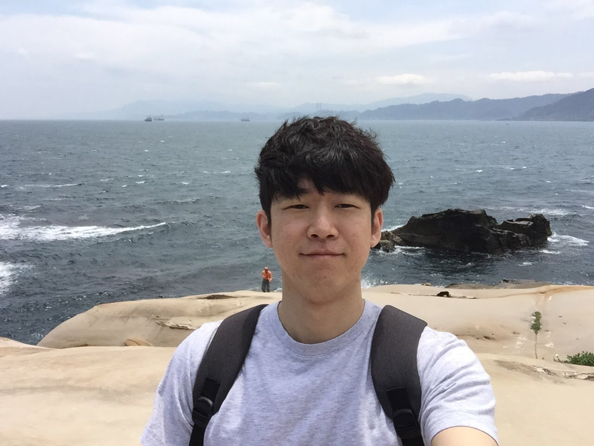

## 소개

<center></center>

- 이름: 최재성

- 군필여부: 병장 만기 전역

- 취미: 당구, 독서, 멍때리기

- Email: [tom.jaesung@gmail.com](tom.jaesung@gmail.com)

- GitHub: [https://github.com/TomChoi](https://github.com/TomChoi)

- LinkedIn: [linkedin.com/in/jaesung-choi](https://www.linkedin.com/in/jaesung-choi-2817ab161/)

- 난 어떤 사람인가?

  ```
  비전공자로써 C/C++ 등의 Low Level 언어로 개발을 시작하면서 컴퓨터의 구조 및 기본 동작 원리 및 운영체제의 역할 및 동작에 대한 호기심으로 컴퓨터 기본 지식에 대한 공부를 꾸준히 했습니다. 동작만 하는 프로그램을 만드는 것보다 동작에 대한 원리를 이해하고 프로그램을 만드는 것에 흥미를 느낍니다. 스타트업에서 5년 6개월을 저에겐 모든 일이 새로운 도전이었습니다. 그래서 새로운 기술을 익히고 받아들이는 것에 대해 자신이 있습니다. 지금도 부족한 점이 많지만 앞으로도 겸손하고 배움을 즐기는 개발자가 되고 싶습니다.
  ```

- 좋아하는 글

  ```
  인생의 소란함과 혼란스러움 속에서
  너의 영혼을 평화롭게 유지하라.
  부끄럽고, 힘들고, 깨어진 꿈들 속에서도
  아직 아름다운 세상이다.
  즐겁게 살라. 행복하려고 노력하라.
  ```


## 회사경력

- [가우디오랩](gaudiolab.com) 5년 6개월 (2015.05 ~ 현재)


## 학력

- 한국산업기술대학교 메카트로닉스 공학 졸업 (2008.03 ~ 2014.02)


## 사용 기술

### DSP (상)

Matlab으로 구현된 오디오 알고리즘을 이해하고 Google Unit Test를 이용해 TDD 기반으로 C or C++ 언어로 포팅할 수 있는 스킬을 갖고 있습니다.

- C / C++ / Matlab
- Audio Signal Processing
  - 오디오 DSP 알고리즘을 이해하고 C/C++로 구현하고 플랫폼 또는 라이브러리에 통합 및 오디오 이슈에 대한 디버깅 능력이 있음
- CMake

### Unity (중)

기본적인 사용 방법을 알고 간단한 프로토타입을 만들고 Audio Plugin에 대해 잘 알고 있으며, 각 플랫폼에 맞는 Native Audio 라이브러리를 적용해 통합할 수 있는 스킬을 갖고 있습니다.

### Android (중)

Exoplayer를 이용한 동영상 앱을 만들 수 있으며, Exoplayer의 오디오, 비디오 동작에 대한 이해가 있고 오디오 알고리즘을 적용 하고 디버깅을 통해 문제를 해결 할 수 있는 스킬을 갖고 있습니다.

- Java
- Exoplayer
- OpenGL (하), OpenSL
- JNI, ndk-build, gradle

### Backend (하)

노드 기반의 클라이언트와 데이터를 주고 받는 API를 만들고 동작하는 서버를 만들 수 있는 스킬을 갖고 있습니다.

- Node.js
- Express
- MySQL / Redis
- docker

### Frontend (하)

간단한 프로토타입을 만들 수 있는 정도의 실력을 갖고 있습니다.

- React

### Process (상)

- 커뮤니케이션 - Slack
- 이슈관리 - Jira(애자일/스프린트/칸반) / Confluence
- CI/CD - Jenkins / Artifactory
- 버전관리 - Git

### 공부 중인 분야

현재는 아래것들을 익히고 있습니다.

- 네트워크 이론
  - 예전부터 네트워크 통신이 이뤄지는 원리에 대한 호기심이 있었다. 그래서 Server / Client 등을 공부하며 동작 원리를 익히고 이제는 네티워크를 공부하며 더 깊은 부분을 이해하려 노력


## 프로젝트 이력

- #### 각종 Demo 구현 및 유지보수

  - 진행기간
    - 1년 1개월 (June, 2015 ~ July, 2016)
  - 주요내용
    - Unity를 이용해 가우디에서 개발한 VR 기술(Object Renderer, Reverb)이 적용된 Mac용 Standalone 데모 앱 제작
    - Tower 데모: 가상의 사무실 환경으로 두 개의 방으로 이루어져 있다. 사용자를 의미하는 1인칭 시점의 플레이어가 있으며, 첫 번째 방의 중앙엔 오르골이 위치해 있으며 플레이어가 방을 돌아다니면 오르골의 위치감을 소리로 느낄 수 있음. 두 번째 방에는 중앙에 쥬크박스가 있고 넓은 공간의 느낌을 주는 Reverb 효과를 느낄 수 있음
    - 큐브 데모: 4개의 Scene으로 구성되어 있으며, 플레이어의 위치는 고정되어 있고 머리만 회전할 수 있다. 각 Scene은 VR 오디오 기술을 잘 보여줄 수 있는 가상의 환경을 만듬
  - 본인이 기여한 점
    - 외주를 통해 제작된 기본 사무실 환경의 Unity 프로젝트를 디자인 회의를 통해 나온 수정사항을 반영하여 수정
    - C++ 코드로 구현된 VR 라이브러리를 빌드 후 유니티의 Native Audio Plugin을 이용해 라이브러리 통합
    - 큐브 데모의 제작 및 유지 보수
  - 사용한 기술 또는 지식
    - Unity, Native Audio Plugin, C#, C++
  - 결과/성과
    - 안정적으로 동작하는 Mac용 데모를 두 개 제작함으로써 2015 Naver Deview를 시작으로 2016 유니티 개발자 컨퍼런스 등에서 성공적으로 시연.


- #### GPlayer 개발 및 유지보수

  - 진행기간
    - 1년 5개월 (August, 2016 ~ December, 2017)
  - 주요내용
    - GPlayer는 Unity로 제작된 360 비디오 플레이어로 GA5라는 포맷의 영상을 재생할 수 있고, 가우디의 Object, Channels, HOA  Rendering 오디오 기술이 적용되어 있음
    - GearVR, Oculus, Vive 등의 디바이스에서 동작하기 위해 각 디바이스에서 제공하는 Unity Plugin을 통합하고 각 플러그인에서 제공하는 카메라, 컨트롤러 등을 적용해 동작을 구현
    - Mono, Top & Bottom, Left & Right 화면 구성 모두 지원
    - Low Latency 재생을 위한 오디오 재생 기능 구현
    - 지원 디바이스: Gear VR, Google Cardboard, Vive, Oculus
    - 지원 운영체제: Windows, Mac, Android, Android TV
  - 본인이 기여한 점
    - 처음 8개월 동안 혼자 개발을 시작해 GPlayer 구조 및 기본 기능 구현
    - 멀티 플랫폼(Android, Mac, Windows) 동작을 위한 Unity 프로젝트 구성
    - OpenGL을 이용한 360 비디오 렌더링 구현
    - OpenSL, Circular buffer 구현을 통해 Low Latency 오디오 재생 로직 구현
  - 사용한 기술 또는 지식
    - C++, Unity, Exoplayer, OpenSL, OpenGL, Java, Jni, WASAPI
  - 결과/성과
    - AT&T, LittlStar, TiledMedia 등의 고객과 협업을 통해 비지니스 진행
    - 2016 AES, 2016 TechCrunch 등의 컨퍼런스에서 안정적인 데모 시연


- #### Immersive 오디오 SDK 개발

  - 진행기간
    - 1년 1개월 (January, 2018 ~ January, 2019)
  - 주요내용
    - Immersive 오디오의 주요 기능인 Object, Channel, Ambisonics Renderer의 Matlab 코드를 C/C++ 코드로 변경 및 검증 코드 구현
    - 다양한 플랫폼(Android, Mac, iOS, Unity)으로의 빌드를 하나의 프로젝트에서 빌드 가능 하도록 환경 구축
  - 본인이 기여한 점
    - Object Renderer의 HRTF 데이터의 경량화를 위한 기능 구현
    - HOA Renderer의 뒷 부분인 채널 신호를 위치 시키는 로직 구현
    - Immersive 오디오 라이브러리를 GPlayer에 통합하여 정상 동작 확인
  - 사용한 기술 또는 지식
    - Object, HOA Renderer의 원리와 변환 과정을 이해하고 기능 구현
    - 오디오 신호처리의 기본인 FFT, IIR, FIR, Convolution 등에 대한 이해
    - CMake, C/C++, Matlab
    - Java, ExoPlayer
  - 결과/성과
    - 성공적으로 Immersive 오디오 라이브러리를 만들어 GPlayer에서 정상 동작 확인
    - Mac, iOS, Android, Unity, Windows 등의 플랫폼에서 바로 사용 가능한 형태의 라이브러리 준비


- #### Jake

  - 진행기간

    - 4개월 (February, 2019 ~ May, 2019)

  - 주요내용

    - Jake는 Loudness Normalizer 제품의 QA를 위한 데이터를 자동으로 만들어 주는 Web 서비스로 QA팀이 다양한 컨텐츠의 데이터를 하나씩 수작업 하는 것을 보고 지속적으로 QA 가능한 Web 서비스를 만듬

  - 본인이 기여한 점

    - 혼자서 진행한 프로젝트로, 제품 기획 및 Front-end, Back-end 구현

  - 사용한 기술 또는 지식

    - Node.js, Express, MySQL,
    - Javascript, HTML, CSS

  - 결과/성과

    - QA팀이 하나씩 돌려 데이터를 정리하던 것이 자동으로 데이터를 만들어 결과 데이터에 대한 분석하는 시간이 늘어 QA의 업무 효율 향상

    - 오디오 QA의 중요한 부분인 실제 귀로 들어보는 시간이 증가


- #### 신규 오디오 기술에 대한 제품화

  - 진행기간

    - 5개월 (June, 2019 ~ October, 2019)

  - 주요내용

    - Lab 팀에서 연구한 신규 오디오 기술인 Spatial Audio, Binaural Speaker를 제품화 및 데모 제작

  - 본인이 기여한 점

    - Spatial Audio , Binaural Speaker의 Matlab 코드를 TDD 기반으로 C++로 컨버팅
    - 두 기술에 대한 Mac, iOS 데모 앱 제작

  - 사용한 기술 또는 지식

    - Matlab, C++, Swift, CoreAudio

  - 결과/성과

    - ODK Creative 고객사에 전달하여 Immersive Audio 시연회에서 성공적인 시연

    - 다양한 고객사에 Spatial Audio, Binaural Speaker 기술에 대한 소개 및 데모 시연에 사용


- #### Music Streaming SDK 개발

  - 진행기간
    - 1년 1개월 (November, 2019 ~ November, 2020)
  - 주요내용
    - Vive, Flo, Bugs 등 Music Streaming 앱에서 사용되는 제품으로 SolMusicOne 이라 부르며, Loudness Normalization, ELEQ, Spatial Upmix, Smart EQ 등의 세부 기능을 포함한 라이브러리 개발
    - DynamicQueue 개발
      - 내부 구조상 고정된 프레임 사이즈만 입력으로 받을 수 있는 라이브러를 자유로운 프레임 사이즈를 입력으로 받을 수 있는 기능 개발
    - Fade In/Out 기능 개발
    - Android, iOS, Windows, Mac, Web, CentOS DSP Chip에 통합 할 수 있는 형태로 개발
    - TDD 기반으로 개발을 진행 하고, Jenkins를 통해 CI/CD 파이프라인을 구축해 안정적인 빌드 및 검증
    - 임베디드 오디오 포팅
      - Qualcomm Snapdragon 칩에 SolMusicOne 라이브러리 포팅 및 스마트폰 제조사의 QA 프로세스 대응
      - QCC5121 칩에 개발 환경 세팅 및 ELEQ, Spatial Upmix 통합 및 디버깅
      - 연산량 측정 및 최적화를 위한 작업
        - Memory 접근을 최소화하기 위한 코드 전수조사 및 코드 리펙토링
  - 본인이 기여한 점
    - ELEQ 기능 구현, Loudness Normalization Unit Test 구현
    - DynamicQueue 아이디어 제안 및 구현, 검증 후 프로젝트에 통합
    - Fade In/Out 기능에 대한 Idea 제시 및 알고리즘 구현 및 통합
    - GCove를 도입해 코드 커버리지를 확인 할 수 있도록 만들고, JenkinsFile 을 도입해 하나의 프로젝트에서 CI/CD 관리까지 이루어 지도록 만듬
    - Hexagon SDK를 스터디 하여 Snapdragon 칩에서 동작 가능한 SolMusicOne 제품 구현 및 스마트폰 제조사의 QA 이슈 실무 지원
    - Android 내부 오디오 시스템 및 AudioEffect 스터디 및 SolMusicOne 통합.
    - QCC5121 칩에 개발 환경 세팅 및 ELEQ, Spatial Upmix 통합 및 디버깅
  - 사용한 기술 또는 지식
    - Google Unit Test, GCove, Valgrind, CppCheck, Jenkins
    - Hexagon SDK(version 3.5.1), AOSP AudioEffect, Qualcomm Tools(QACT)
  - 결과/성과
    - SolMusicOne이 적용된 상용 디바이스 정상 출시
    - DynamicQueue를 적용하여 고객사로 부터 들어오는 프레임 사이즈에 대한 이슈 해결
    - Fade In/Out 기능을 통해 On/Off 시 발생하는 노이즈 이슈 해결


- #### Side Project

  - 새로운 기술에 대한 호기심과 실무에서 개선이 필요한 부분을 찾아 개선하는 것에 재미를 느낌

  - #### Resource Manager

    - 주요 내용
      - 개발팀의 CI 스텝중에 레퍼런스 Wav 파일과 개선된 알고리즘에서 추출한 Wav를 비교하는 SNR 체크 스텝이 있는데 음원을 개발자 각자가 로컬에서 관리하여 음원이 잘못되어 오랜 시간을 소요하는 경우가 많았음. 이를 위해 Electron과 React로 만든 Mac용 Standalone 앱과 Node.js 와 Express로 만든 API 서버를 만듬.
    - 사용한 기술
      - Electron, React, Node.js, Express, MySQL
    - 결과/성과
      - SNR 체크를 위한 wav 파일을 서버에서 관리하여 잘못된 파일로 테스트하여 문제가 되는 상황을 해결

  - #### Gaudiobob

    - 주요 내용
      - 점심시간이 정해져 있어 그 시간이 되면 회사 1층에 모여 모두 점심을 어디로 먹으러 갈 지를 고민한다. 대부분의 사람들이 무엇을 먹을지 생각이 없다. 간혹 사람들이 누군가 졍해줬으면 좋겠다는 말을 할 정도로 점심 매뉴를 정하는 것은 쉽지 않았다. 이 문제를 해결하기 위한 대책으로 회사에서 자주 가는 맛집 리스트를 DB화 하고 주변 음식점 리스트를 구글 맵을 통해 정보를 받은 후 누군가 먹을 곳을 정하면 그 곳에 가고 싶은 사람들이 참석 버튼을 누를 수 있는 앱이다. 단체로 모였을 때 말하기 힘든 경우 누군가 원하는 시간과 장소를 정해 올리면 누구나 참석 버튼을 눌러 점심을 먹으러 갈 수 있음

    - 사용한 기술
      - React Native, Node.js, Express, MySQL
      - Google Map API

    - 결과/성과

      - 서비스는 오래가지 못했음 생각보다 사람들이 자신이 어디에서 밥을 먹었고 어딜 갈지에 대한 기록이 남는 것을 싫어 했고 또 다른 서비스의 등장을 반가워 하지 않았음.


- #### 연구 개발에 참여

  - "오디오 신호 처리 방법 및 장치" 연구 개발에 참여
    - 주요 내용
      - 위 기술은 마이크가 달린 이어폰을 사용하는 경우 사용자가 귀에서 이어폰을 빼는 상황을 마이크를 통해 센싱하여 자동으로 노래를 멈추는 기술
    - 기여한 점
      - 아이디어 단계의 기술을 실험을 계획하고 데이터를 추출하여 동작 검증
    - 결과/성과
      - HCI Korea 학회 포스터 논문 발표 (January 28, 2016)
      - KR(10-2016-0154366), US(15/356530) 특허 획득

----

여기까지 읽어주셔서 감사합니다.
